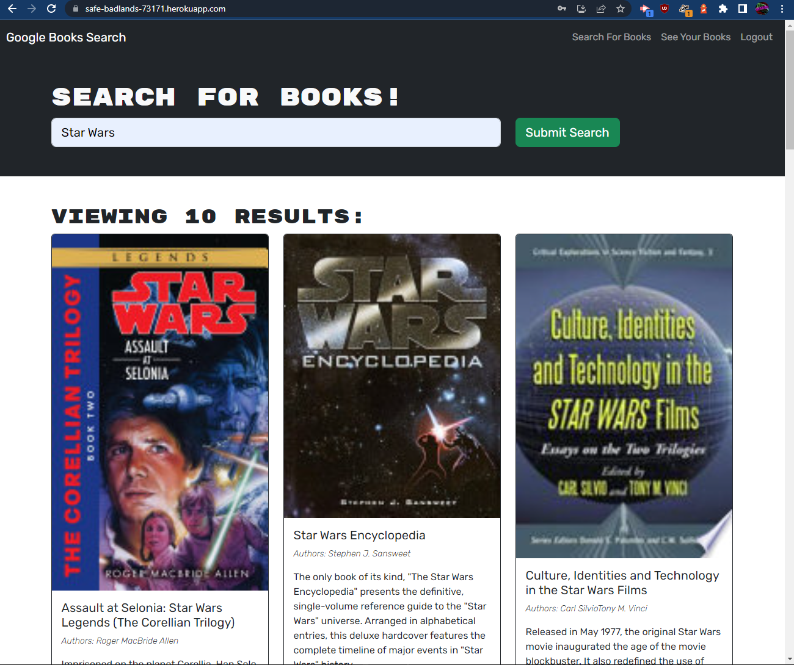

# Book Search Engine

## Description

The point of this project was to refactor an existing Book Search Engine. It initally used RESTful API but has now been converted to use GraphQL API built with Apollo Server. The app is also built following the MERN stack with a react front end. Creating the TypeDefs and resolvers was easy enough for me the challenge was converting the client side of the application. My largest struggle was due to the nature of my changes it was hard to test as I went along. But that is something I can improve in the future.

## Installation

No installation required this application is deployed at:
https://safe-badlands-73171.herokuapp.com/

## Usage

To use this book search engine, you can type in the search bar and will list 10 results.
The user is able to create an account to be able to save their favourites frm the searches.
As well as be able to remove the books from their saved list.

Demo Image:

## Credits

Mark Napolitano

## License

ISC License

---